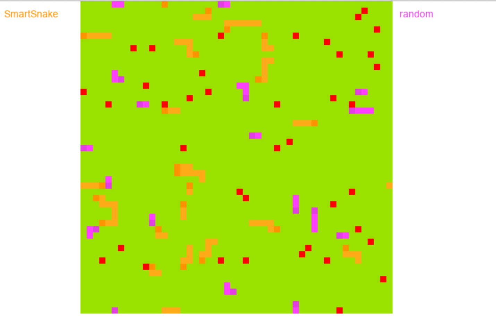

## Snakes AI

###### @Author Luka Didham

### Overview
Snakes is a game where two species of snakes compete on a S×S square plane with an equal amount of snakes from each species generated at random across the plane. Snakes are able to traverse this plane moving one square of the SxS plane each turn. Snakes are able to choose from three actions which is either continue going forward, or turning at ninety degrees to its left or right. Food is continuously generated equal to the number of snakes in the game. Snakes are able to consume food items by passing over them. Every time a food item is consumed another food item is randomly generated at a random point in the plane maintaining food levels equal to snakes. Every time a snake eats a food item they will grow by one segment initially spawning as two segment long snakes of a head and one body length. A snake can die and be removed from the game by having its head collide with the body of any other snake, including itself and its own species. The aim of the game is for one species of snakes to defeat the other by obtaining a larger ”average max size score” made up from all the individual max lengths of every snake in the species. Since snakes consume food to grow the max length of a snake is directly related to food consumed so the objective of each species is to collectively consume the most food without dying and killing opposing species snakes as quickly as possible.

### Implementation Overview
My implementation is a single layer perception-like model using three functions for each action evolving using a genetic algorithm. The model searches through possible states and selects the states with “desired” behaviours given by the fitness function of,
F = maxSize+turnsAlive/N. The first generation has random values from -50 to 50 for each chromosome which should make the snake behave randomly, but over training, should lead to an increasing average fitness function and Tournament score analysed below. My implementation also utilises Roulette Wheel Selection, Mutation, Elitism and Intelligent K-Point Crossover.
My implementation supports all precept ranges and game settings except for ”percept- Frames” which gives the snakes a ”memory” of previous world sates. I decided not to implement this feature for lack of time as well as confidence that my Single-Layer Perception model is not powerful enough to reap the benefits. I do however experiment heavily with varying nPercept values and Training Schedules.

### Usage
Is automatically set to train for 50 games and then play 10 tournamnet games. Simply run,
`python snakes.py`
